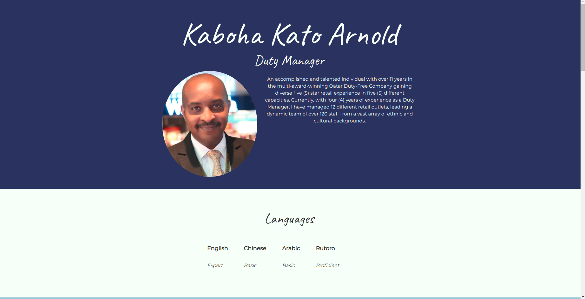
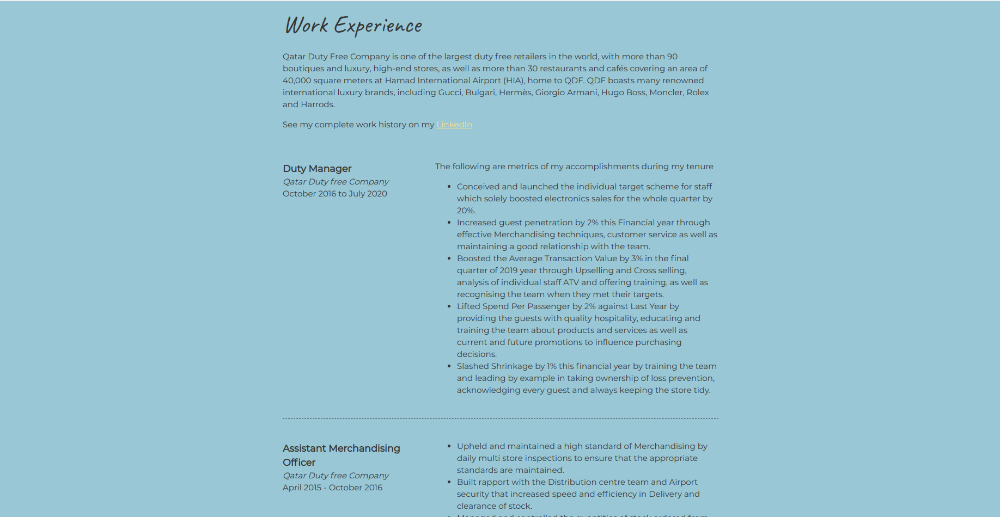
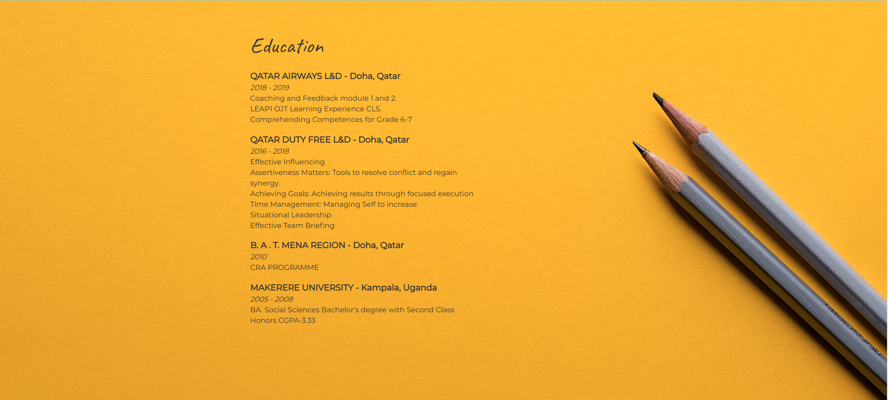

## Professional Portfolio

### Rationale

Create a personal website that contains CV relevant information for recruiters.

### Illustrations
Profile

Work Experience

Education

Contact

### Demo
A live demo of the application is found [here](https://katokaboha.github.io/portfolio/)

### Technologies used
- HTML5
- CSS3